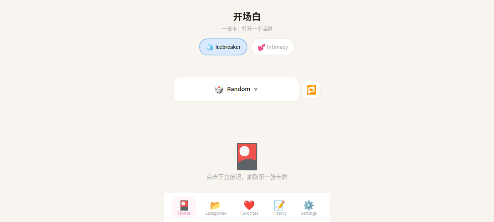
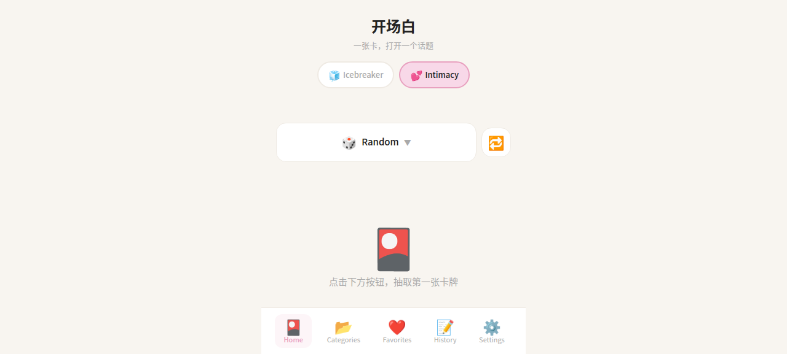

# 开场白 Opening Line

一张卡，打开一个话题。

个人使用的破冰/亲密话题卡片应用，基于 Vue 3 + Capacitor 构建的 Android 应用。

## ✨ 功能特点

- 🎴 **离线题库** — 240+ 道精选问题，无需网络即可使用
- 🤖 **AI 生成** — 支持 DeepSeek / 通义千问 / OpenAI 等 LLM 生成新问题
- 🌍 **双语支持** — 英文为主，一键切换中文翻译
- 🧊💕 **双模式** — Icebreaker（破冰）和 Intimacy（亲密）两种风格
- 🏷️ **6 大分类** — Random / If You Could / Would You Rather / Experiences / Life / Deep
- 🔄 **循环模式** — 自动轮换分类，适合派对/聚会场景
- ❤️ **收藏夹** — 保存喜欢的问题
- 📤 **分享卡片** — 导出精美卡片图片分享到社交平台
- 🌙 **深色模式** — 支持浅色/深色/跟随系统
- 🎚️ **自定义** — 可调节问题深度（Light/Medium/Deep）和语气（Light/Formal/Humorous/Warm）

## 📱 截图

<div align="center">
  
  
  
</div>

## 🛠️ 技术栈

| 层级 | 技术 |
|------|------|
| 框架 | Vue 3 + TypeScript + Vite |
| 样式 | Tailwind CSS 4 |
| 状态管理 | Pinia 3 |
| 本地存储 | Dexie.js (IndexedDB) |
| 原生打包 | Capacitor 6.x |
| 构建目标 | Android (API 34, AGP 8.2.0) |

## 🚀 快速开始

### 环境要求

- Node.js 18+
- Java 17
- Android SDK (Platform 34, Build Tools 34.0.0)

### 安装依赖

```bash
npm install
```

### 开发模式

```bash
npm run dev
# 浏览器访问 http://localhost:5173
```

### 构建 Android APK

```bash
npm run build
npx cap sync android
bash fix-all-mirrors.sh   # 配置国内镜像源
cd android
./gradlew assembleRelease
```

APK 输出路径：`android/app/build/outputs/apk/release/app-release.apk`

### 国内镜像说明

项目已配置阿里云 Maven 镜像和腾讯云 Gradle 镜像，解决国内网络问题。`cap sync` 会覆盖镜像配置，需重新运行 `fix-all-mirrors.sh`。

## 📂 项目结构

```
icebreaker/
├── src/
│   ├── components/     # Vue 组件
│   ├── pages/          # 页面（Home/Category/Favorite/History/Settings/About）
│   ├── stores/         # Pinia 状态管理
│   ├── services/       # 业务服务（LLM/分享/去重/存储）
│   ├── types/          # TypeScript 类型定义
│   ├── db/             # Dexie.js 数据库
│   └── styles/         # 全局样式 + CSS 变量
├── public/
│   ├── offline_questions.json          # Icebreaker 离线题库 (120题)
│   └── offline_questions_intimacy.json # Intimacy 离线题库 (120题)
├── android/            # Capacitor Android 项目
└── fix-all-mirrors.sh  # 国内镜像修复脚本
```

## 🔑 LLM 配置

在设置页面中配置你的 API Key：

| 提供商 | Base URL | 模型 |
|--------|----------|------|
| DeepSeek | https://api.deepseek.com | deepseek-chat |
| 通义千问 | https://dashscope.aliyuncs.com/compatible-mode/v1 | qwen-plus |
| OpenAI | https://api.openai.com/v1 | gpt-4o-mini |

## 📄 License

MIT License

## 🙏 致谢

- [Vue 3](https://vuejs.org/) — 渐进式 JavaScript 框架
- [Capacitor](https://capacitorjs.com/) — 跨平台原生应用运行时
- [DeepSeek](https://www.deepseek.com/) — AI 语言模型
